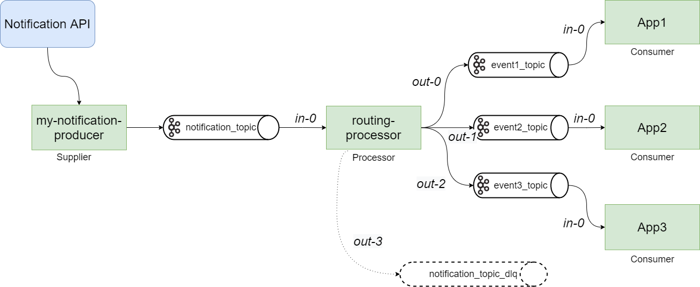

# Implémentation du Fan-out Pattern avec Spring Cloud Stream et KafkaStreams.

## Besoin métier
Une application externe envoie des notifications de type WebHook à travers notre API qui est responsable de distribuer 
ces messages aux différentes applications internes de notre SI, en les répartissant dans des topics distincts.
 Pour répondre à ce besoin, nous allons implémenter le [Fan-out Pattern](https://en.wikipedia.org/wiki/Fan-out_(software))
avec Spring Cloud Stream en faisant transiter ces messages à travers des topics Kafka. Notre API a l’avantage de répondre
rapidement au WebHook, étant donné que l’on ne fait que produire un message qui sera consommé de manière asynchrone.

## Fan-out pattern
Le Fan-out pattern est un pattern de messaging bien connu dans les architectures event-driven.
Le producer publie ses messages dans un topic d'échange. Ce topic est chargé de dispatcher ces messages 
en fonction de critères pré-établis dans d'autres topics. Les consommateurs des applications cibles sont
en écoute sur ces topics, afin de récuperer leurs messages respectifs.

## Spring Cloud Stream
[Spring Cloud Stream](https://spring.io/projects/spring-cloud-stream) est un framework qui permet de connecter 
des microservices entre eux à travers un système de messaging. Plusieurs Binders sont implémentés 
(RabbitMQ, Kafka, Kafka Streams, Google PubSub, Azure Event Hubs, ...).

### Spring Cloud Function
[Spring Cloud Function](https://spring.io/projects/spring-cloud-function) permet d'exposer simplement des fonctions 
sous forme de @Beans. Il est de plus en plus utilisé dans le cadre des architectures Serverless
et Function-as-a-Service (FaaS). 

Depuis la version 2.1, Spring Cloud Stream intégre le support de Spring Cloud Function,
avec une approche alternative dans la manière de définir les streams, en se basant sur la programmation
fonctionnelle, en déclarant des beans de type ```java.util.function.[Supplier/Function/Consumer]```.

### Approche réactive
Les Functions peuvent utiliser l'approche imperative ou réactive.
Dans la première, les functions sont déclenchées à chaque évenement.
Dans la seconde, on gère un flux d'évenement à l'aide de Flux et Mono du Projet [Reactor](https://projectreactor.io/)). 
C'est ce que l'on utilise dans notre exemple.

### Kafka Streams
Kafka Streams est une librairie de Kafka qui permet de traiter les données à la volée
et en temps réel, avec de faible latence tout en étant scalable.
Elle permet de manipuler des KStreams et des KTables.

## Implémentation


- _Supplier_

Déclaration du bean Supplier, qui va produire le message dans le topic _notification_topic_
```java
    @Bean("notification-producer")
    NotificationProducer notificationProducer() {
        return new MyNotificationProducer();
    }
```
Implémentation du Supplier avec flux réactif à l'aide de la librairie Reactor
```java
@Slf4j
public class MyNotificationProducer implements Supplier<Flux<Message<NotificationEvent>>>, NotificationProducer {

    private Sinks.Many<Message<NotificationEvent>> sink = Sinks.many().unicast().onBackpressureBuffer();

    @Override
    public void produce(NotificationEvent event) {
        log.info("Emit event : " + event);
        Message<NotificationEvent> message = MessageBuilder
                .withPayload(event)
                .setHeader(KafkaHeaders.MESSAGE_KEY, toKey(event))
                .build();
        sink.emitNext(message, Sinks.EmitFailureHandler.FAIL_FAST);
    }

    @Override
    public Flux<Message<NotificationEvent>> get() {
        return sink.asFlux();
    }

    private String toKey(NotificationEvent event) {
        return "key_" + event.getId();
    }
}
```
- Function _routing-processor_ 
  - Utilise Kafka Stream pour router les messages à l'aide de .branch() et de prédicats.\
    La règle est la suivante : \
    _si le message en entrée contient "event1", on route sur le topic event1_topic\
    si le message en entrée contient "event2", on route sur le topic event2_topic\
    si le message en entrée contient "event3", on route sur le topic event3_topic\
    sinon on route sur le topic notification_topic_dlq_
  - La méthode _branch()_ route vers les sorties multiples _out-0_, _out-1_, _out-2_ et _out-3_.
    D'autres méthodes de KStream permettent aussi de faire du _filter()_, _map()_, _flatMap()_, _groupBy()_.
    La méthode _to()_ redirige vers un unique topic.

```java
    @Bean("routing-processor")
    public Function<KStream<String, NotificationEvent>, KStream<String, NotificationEvent>[]> routingProcessor() {

        Predicate<String, NotificationEvent> isEvent1 = (k, v) -> EVENT_1.equals(v.getType());
        Predicate<String, NotificationEvent> isEvent2 = (k, v) -> EVENT_2.equals(v.getType());
        Predicate<String, NotificationEvent> isEvent3 = (k, v) -> EVENT_3.equals(v.getType());
        Predicate<String, NotificationEvent> isEventUnknown = (k, v) -> !Arrays.asList(EVENT_1, EVENT_2, EVENT_3).contains(v.getType());

        return input -> input.branch(isEvent1, isEvent2, isEvent3, isEventUnknown);
    }
```
- _Consumer_
  - La fonction du consumer event1 est de consommer et logger le message dans le topic event1. De même pour les event2 et event3.\
Ces 3 consommateurs sont dans le même projet mais pourraient être dans des projets Spring Boot séparées.
```java
    @Bean
    public Consumer<NotificationEvent> event1() {
        return data -> log.info("Data received from event-1... " + data.getAction());
    }
```
- _application.yml_
  - Le fichier de configuration contenant la déclaration du broker, les définitions des cloud functions et les différents bindings.
    La déclaration des bindings respectent la convention de nommage suivante : &lt;functionName&gt; + -in- + &lt;index&gt;.   
```yaml
spring:
  cloud:
    stream:
      kafka:
        binder:
          brokers: localhost:29092
          producer-properties:
            key.serializer: "org.apache.kafka.common.serialization.StringSerializer"
        bindings:
          routing-processor-in-0.consumer.configuration.value.deserializer: org.springframework.kafka.support.serializer.JsonDeserializer
          routing-processor-out-0.producer.configuration.value.serializer: org.springframework.kafka.support.serializer.JsonSerializer
      bindings:
        notification-producer-out-0.destination: notification_topic
        routing-processor-in-0.destination: notification_topic
        routing-processor-out-0.destination: event1_topic
        routing-processor-out-1.destination: event2_topic
        routing-processor-out-2.destination: event3_topic
        routing-processor-out-3.destination: notification_topic_dlq
        event1-in-0.destination: event1_topic
        event2-in-0.destination: event2_topic
        event3-in-0.destination: event3_topic
    function:
      definition: notification-producer;routing-processor;event1;event2;event3
```
## Démo du projet fanout-routing

Démarre Zookeeper, Kafka and Kafka-ui avec docker-compose
```
  docker-compose up -d
```

Démarre l'application
```
  mvn spring-boot:run
```

Envoi de notification sur notre endpoint en curl
```
 curl -i -X POST -H 'Content-Type: application/json' -d '{"id": 0,"type": "event1","action": "object.created"}' http://localhost:8080/notification
```

Ou poster votre notification depuis Visual Studio\
En essayant de changer dans la request l'application cible par _event1_ ou _event2_ ou _event3_


Visualiser les logs ou se connecter sur http://localhost:28080/ui pour voir les messages transiter dans les différents topics


L'intégralité des sources sont sur [Github](https://github.com/sfoubert/fanout-routing)

---

## Conclusion
- Il y a certainement beaucoup de manières différentes de répondre au besoin initial. L'avantage de l'implémentation 
présentée ci-dessus est qu'elle nécessite au final très peu de code et de configuration.
- Spring Cloud Stream permet de supprimer la dépendance avec le middleware de message 
et les bindings sont facilement adaptables.
- Spring Cloud Function permet une meilleure lisibilité du code, en permettant de se 
passer des annotations que l'on avait avec Spring Cloud Streams en legacy. ex:
_@Input("") MessageChannel publisher();_ _@Output("") MessageChannel publisher();_ et en ne manipulant 
que des fonctions (Supplier/Function/Consumer).

## Références
- https://www.confluent.io/blog/putting-events-in-their-place-with-dynamic-routing/
- https://spring.io/blog/2019/12/03/stream-processing-with-spring-cloud-stream-and-apache-kafka-streams-part-2-programming-model-continued
- https://blog.avenuecode.com/processing-messages-with-spring-cloud-stream-and-kafka

